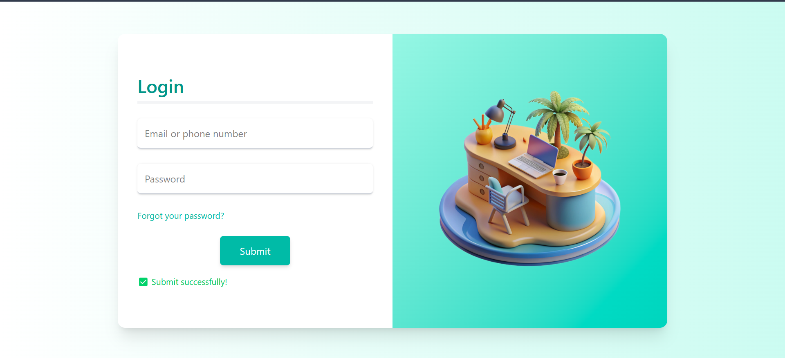

# 📝 React-Node Contact Form

A full-stack contact form built with React for the front-end and Node.js for the back-end. This project allows users to submit their contact details (name, email, message), and the data is processed and stored using a Node.js server.

## 🚀 Live Demo

🔗 [View Live on Vercel](https://react-node-contact-form.vercel.app/)

## 🛠️ Tech Stack

  **Frontend**: React.js, HTML5, CSS3, Axios (for API calls).
- **Backend**: Node.js, Express.js.
- **Styling**: Tailwind CSS.

## Features 🌟

- 🖥️ User-friendly form interface built with React.
- 📝 Validation on form fields (e.g., email, message length).
- 📡 Form data is sent to a Node.js server.

## Getting Started 🚀

Follow these steps to get the project up and running on your local machine.

1. Clone the Repository

git clone (https://github.com/faria-webdev404/react-node-contact-form.git)

 2. Install Frontend Dependencies

  cd react-node-contact-form/client

   npm install

 3. Install Backend Dependencies

   cd ../server

   npm install

  5. Start the Server

  cd server

   npm start
 
## 📸 Screenshot

🙋‍♀️ Author

 Made by Faria Abid
 
 💬 Contact

If you have any questions or feedback, feel free to reach out to me:

Email: [fariaabid473@gmail.com]

